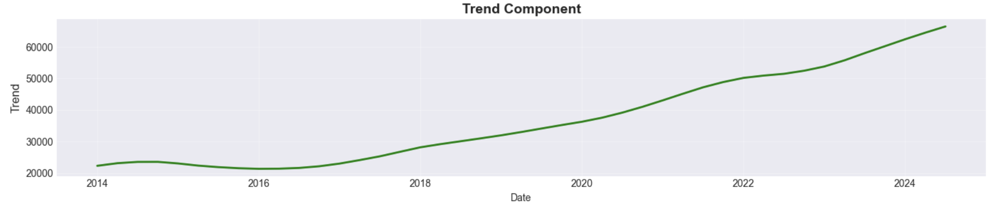

# Microsoft Financial Analysis & Forecasting Model

## Resources

Check out the public [Tableau Dashboard](https://public.tableau.com/app/profile/christopher.cockerill/viz/MicrosoftStrategicMLFinancialModel/Dashboard1) for this project, and the full [Excel Model](/data/processed/Microsoft_Financial_Model_V2.xlsx) (Follow the link, and click on 'View Raw' to download the .xlsx file).

## Project Overview

A financial analysis and forecasting piece examining Microsoft's financial performance, with a focus on their strategic positioning in the AI revolution. This project combines data engineering, statistical modeling, financial analysis, and business intelligence visualization to create insights and financial forecasts.

## Microsoft

In today's turbulent market conditions, Microsoft stands out as a compelling case study due to:

- **AI Leadership**: Partnership with (and investment into) OpenAI and integration of ChatGPT capabilities into Microsoft Copilot
- **B2B AI Commercialization**: Successfully monetizing AI through enterprise solutions (Copilot)
- **Shifting Profit Centers**: Evolving dynamics between traditional products and cloud services (Azure)
- **Market Resilience**: The company has the ability historically speaking to persevere through periods of economic turbulence.

## The Technical Approach

### 1. Data Acquisition & Engineering

- **Source**: Data was sorced from the SEC's EDGAR database - 47 quarters of historical financial data summarised by accountants filing on behalf of Microsoft.
- **Challenge**: Raw data from yfinance proved insufficient, requiring direct extraction from SEC filings
- **Solution**: Located and parsed financial summaries from submissions in several different formats.

### 2. Data Processing & Transformation

- **Cleaning**: Standardized 47 quarters of inconsistent financial data formats
- **Transformation**:
  - Wide format for Excel financial modeling
  - Long format for Time Series modelling
- **Tools**: Python (pandas, numpy)

### 3. Time-Series (Machine Learning) Forecasting

Starting with the historical revenue:

The data was decomposed this line into its trend:

Seasonality:

and residual noise:

Implemented two machine learning, time-series models for 8-quarter revenue forecasting:

- **SARIMA Model**: Captured seasonal patterns and auto-regressive components.

- **Prophet Model**: Facebook's integrated forecasting tool for time series
- **Results**: Both models achieved strong validation accuracy with 95% confidence intervals, with SARIMA slightly outperforming Prophet.

### 4. Financial Modeling (Excel)

Built a comprehensive financial model bringing together 11 years of historical financial data and two years of forecasted data. This included:

- **Income Statement**: Revenue projections with multiple scenarios
- **Balance Sheet**: Asset and liability forecasting with proper balancing
- **Cash Flow Statement**: Operating, investing, and financing activities
- **Supporting Tabs**:
  - Model inputs and assumptions
  - Historical analysis
  - Scenario analysis (baseline, upper, lower bounds for both models)

### 5. Business Intelligence Dashboard (Tableau)

Created interactive visualizations including:

- Revenue forecast comparisons
- Operating margin % trends
- Key Performance Indicators (KPIs)
- Seasonal analysis
- Quarterly variation analysis

## Key Findings

### 1. Revenue Growth Trajectory

- Consistent QoQ revenue growth demonstrated across historical data
- Forecasts indicate continued growth momentum despite market volatility

### 2. AI Competitive Advantage

- Early AI adoption positioning Microsoft ahead of competitors
- B2B AI solutions driving new revenue streams

### 3. Operational Efficiency

- Stable quarterly operating margins maintained
- R&D investment scaling proportionally with revenue growth

### 4. Seasonal Patterns

- Q1 consistently shows lower reported revenue
- Q2 (pre-Christmas quarter) demonstrates strongest performance
- Clear seasonal patterns enable more accurate forecasting

## Tech Stack Used

- **Python**: Data processing, statistical modeling
  - pandas, numpy, statsmodels, prophet
- **Excel**: Financial modeling and scenario analysis
- **Tableau**: Interactive dashboard creation with Power Query integration
- **Jupyter Notebooks**: Exploratory data analysis and model development

## Future Enhancements

- Incorporate additional financial metrics (FCF)
- Expand analysis to competitor comparison within the techology and AI sector
- Integrate auto updating feeds upon new quarterly 10Q or 10K filings

## Contact

📧 **Email**: [crcockerill@gmail.com](mailto:crcockerill@gmail.com)

💼 **LinkedIn**: [Chris Cockerill](https://www.linkedin.com/in/chris-cockerill-33840838/)
